# API-Blueprint-Example
## Overview

This project contains different ways for integrating the Agora Unreal SDK APIs into your project. You can run the project in the main level to experience the major features or in a particular level to experience a specific API example.

## Prerequisites
- An Agora [account](https://docs.agora.io/en/video-calling/reference/manage-agora-account#create-an-agora-account) and [project](https://docs.agora.io/en/video-calling/reference/manage-agora-account#create-an-agora-project).
- Unreal Engine 4.27 or later (including UE5)
- The supported platforms and their requirements are as follows:

| Platform | IDE  | OS | Architecture|Note|
|--|--|--|--|--|
|  Android|  Android Studio 3.5.3 or later| see [the Unreal Engine Android Development Requirements.](https://docs.unrealengine.com/4.27/en-US/SharingAndReleasing/Mobile/Android/AndroidSDKRequirements/)|arm64-v8a, arneabi-v7a|Real devices only (not working on emulators)  NDK version 21
|iOS|XCode 11.0 or later|see [the Unreal Engine iOS and tvOS Development Requirements.](https://docs.unrealengine.com/4.27/en-US/SharingAndReleasing/Mobile/iOS/DeviceCompatibility/)|--|A valid Apple developer signature.
|MacOS|XCode 11.0 or later|OS X 10.11 or later|Intel, M1|A valid Apple developer signature.
|Windows (64bit)|Visual Studio 2019|Windows 7 SP1 or later|Intel|At least 1.65 GB of disk space after the IDE and relevant tools are installed.
|Windows (32bit)|Visual Studio 2019|Windows 7 SP1 or later|Intel|Unreal Engine 5 (UE5) is not supported on 32-bit Windows. If you want to use Unreal Engine 4 (UE4) with 32-bit Windows, uncomment the code relating to Win32 in the *AgoraPluginLibrary.Build.cs* file.


## Case examples

### Full List

**Basic Case**

- BasicAudioCallScene
- BasicVideoCallScene

**Advanced Case**

- ScreenShare
- ScreenShareWhileVideoCall

### Audio Only List

**Basic Case**

- BasicAudioCallScene


## Project setup

### Get the App ID

Before you build and run your project, you need to get the App ID. To copy this App ID, find your project on the [Project Management](https://console.agora.io/projects) page in Agora Console, and click the copy icon in the App ID column.

### Get the App Certificate
When generating a token on your app server, you need to fill in parameters such as the App ID, channel name, user ID, and App Certificate.

To get an App Certificate, do the following:  

1. On the [Project Management](https://console.agora.io/projects) page, click **Config** for the project you want to use.  
2. Click the copy icon under Primary Certificate.   
	
### Generate a temporary token
When a user attempts to join a channel, your app passes an encrypted authentication token to Agora SD-RTN™. This token is unique for each channel. It is generated using the App ID of your project and the channel name. In a test or production environment, your app retrieves the token from a token server. However, for local testing, you can generate a temporary token in Agora Console.

1. In Agora Console, open [Project Management](https://console.agora.io/projects), select your project, and click **Config**.  
2. Under Features, click **Generate temp Video SDK token**.  
3. Type the channel name, then click **Generate**.  
   Agora Console generates a token valid to join that channel only.
4. Click Copy.  
   The temporary token is added to the clipboard of your development machine.

	
### Integrating the SDK

1. Download the [SDK](https://github.com/AgoraIO-Extensions/Agora-Unreal-RTC-SDK-NG/releases).  
2. Create a folder named Plugins in the root directory of your project.  
3. Unzip the SDK files to *Plugins* folder

 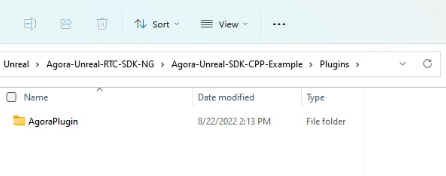


### Compile and run the demo
You can run the demos in a main level or in any level of the API examples.  
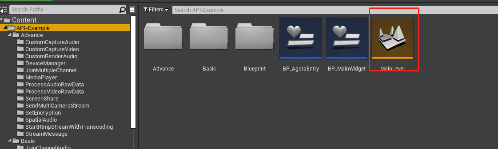
1.Compile and run the project in the main level, and then click the Play button on the UE Editor. You see the main screen as shown in the following image:

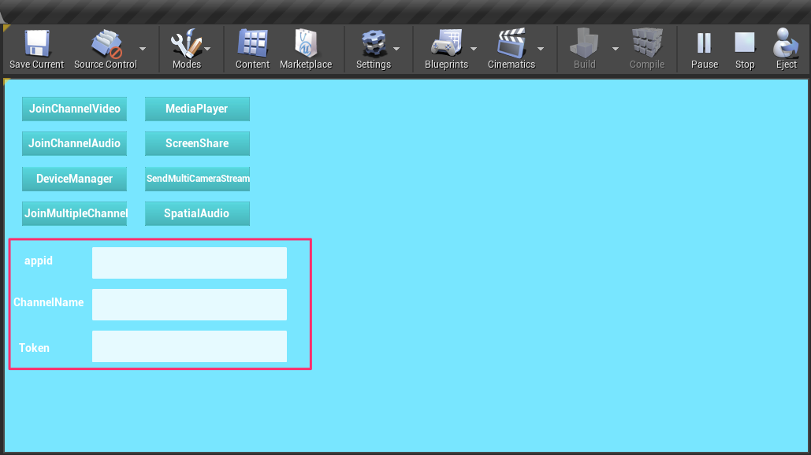

Fill in your App ID, channel name, and token (optional). You can now click a button on the left to navigate to a particular level of the API examples.  
2.Run in a particular level if you want experience an API example. Take *Basic/joinChannelAudio/BasicAudioCall/* as an example:
- Open any level blueprint, for example Basic/joinChannelAudio/BasicAudioCall/ enter your appid and channelname in the position below.
  
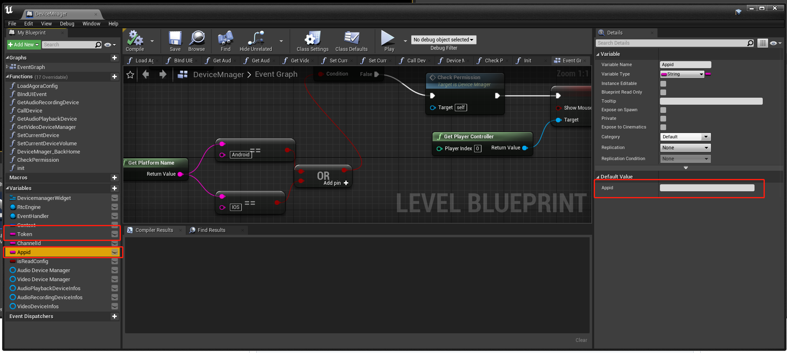


## Project Setting

### Mac / IOS

1. Set **Generate Info.plist File** to True
   
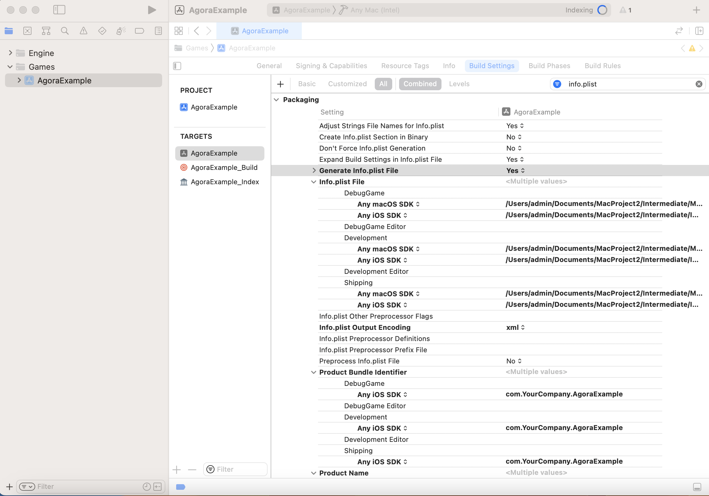


1. If you are using a mac with an M1/M2 chip, you need to set the Destination Architecture to (Rosetta)
    
    Ref: 
    
    - https://support.apple.com/en-us/HT211861


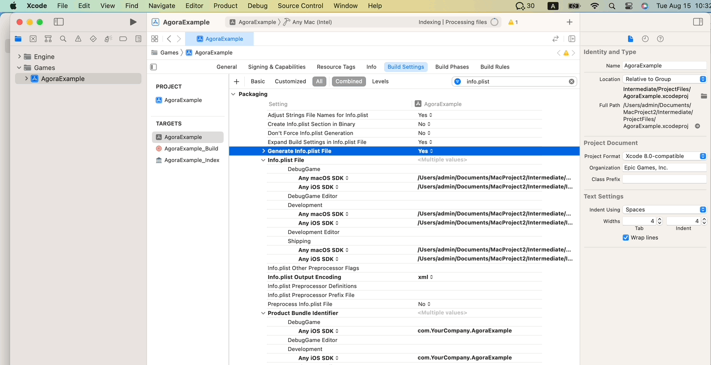

## Project Packaging

### Windows Packaging

Click File > Package Project > Windows > Windows(64-bit).

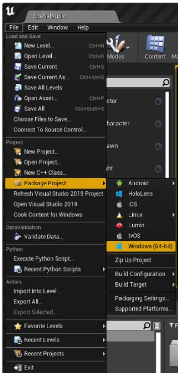

Since UE5 does not support 32-bit Windows, the Agora plugin omits the 32-bit implementation by default. If you want to use 32-bit Windows with UE4, uncomment the code relating to Win32 in the **AgoraPluginLibrary.Build.cs** file, as shown in the red box in the following image:

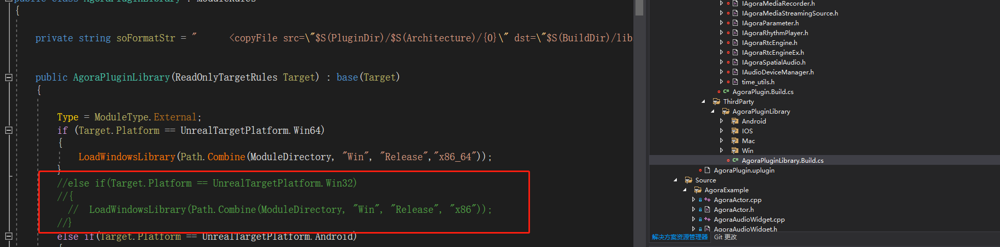

### MacOS Packaging

1. Click File > Package Project > Mac.

2. Add device permissions to plist.info

	a. Right click the compiled xxx.app file, and select **Show Package Contents**.

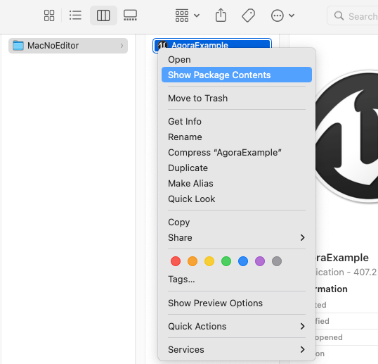

        b. Edit Contents/Info.plist (Double-click to open it in XCode,  then see Step 3 next; or Step 3b if using your favorite text editor).

3. Add permissions.

Double click to open *Contents/Info.plist* in XCode, then click **Information Property List** to add the following permissions:

- Privacy - Camera Usage Description
- Privacy - Microphone Usage Description

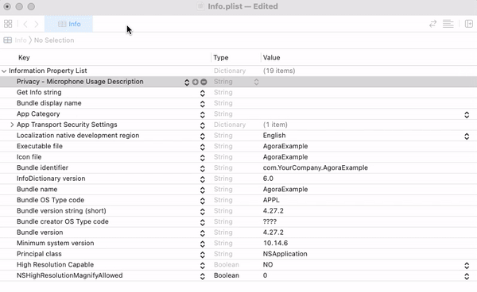

If you are editing with Xcode, you can just open the plist file with a text editor and paste the following XML snippet into it:
```xml
	<key>NSCameraUsageDescription</key>
	<string>Use camera</string>
	<key>NSMicrophoneUsageDescription</key>
	<string>Use mic</string>
```

4. Add the SDK frameworks.

Copy ***.framework** from ***Plugs/AgoraPlugin/Source/ ThirdParty/Agora/MAC/Release*** to ***MacNoEditor/xxx/Contents/MacOS/*** .
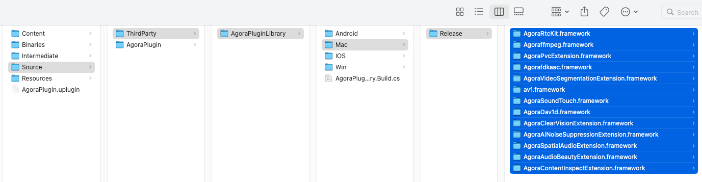

### IOS Packaging
The following permissions are also required on iOS:

- Privacy - Camera Usage Description
- Privacy - Microphone Usage Description

To add the above permissions to the info.plist, you can enter them in the UE Editor.
1. Copy the following single line text:

```xml
<key>NSCameraUsageDescription</key><string>AgoraVideoCall</string><key>NSMicrophoneUsageDescription</key><string>AgoraVideoCall</string>
```
2. Click Edit > Project Settings >Platforms > iOS.
3. Enter the text to the "**additional plist data**" field:
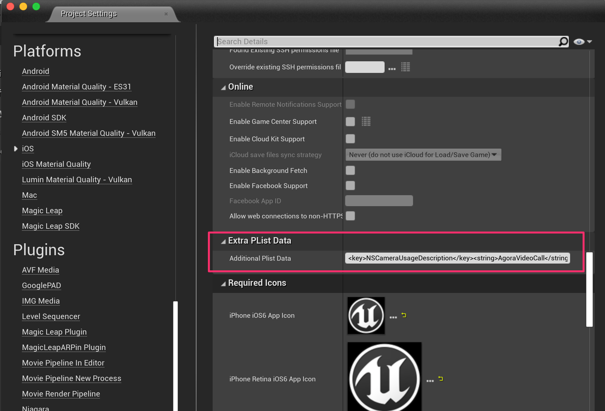


You can package the iOS project (File > Package Project > iOS).

iOS should add the following code to your target as well:

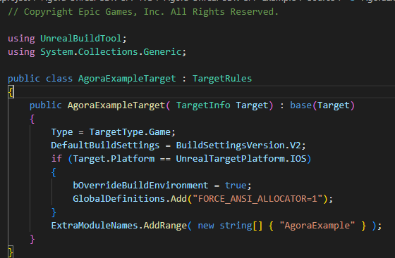

On the iOS platform, Unreal Engine uses the built-in Binned memory allocator by default. For related source code, please refer to FApplePlatformMemory::BaseAllocator().
Here, the global macro definition setting engine uses the standard C memory allocation method on the iOS platform, that is, directly calling malloc, free, realloc and other functions, so as to avoid some abnormal memory release problems when using the Agora plug-in on the iOS platform;

Regarding the performance difference between Ansi and Binned memory allocation: Binned's optimization of small memory usage is better than that of Ansi, but the overall memory usage will be higher, and the overall performance difference between the two is not obvious on mid-to-high-end iOS devices.

### Android Packaging
Build Android via File > Package Project > Android. Note that ASTC is a more common target for modern Android devices.

On Android, the following permissions need to be applied:

- android.permission.RECORD_AUDIO
- android.permission.CAMERA
- android.permission.READ_PHONE_STATE
- android.permission.WRITE_EXTERNAL_STORAGE

the blueprint function is called to enable the permissions.

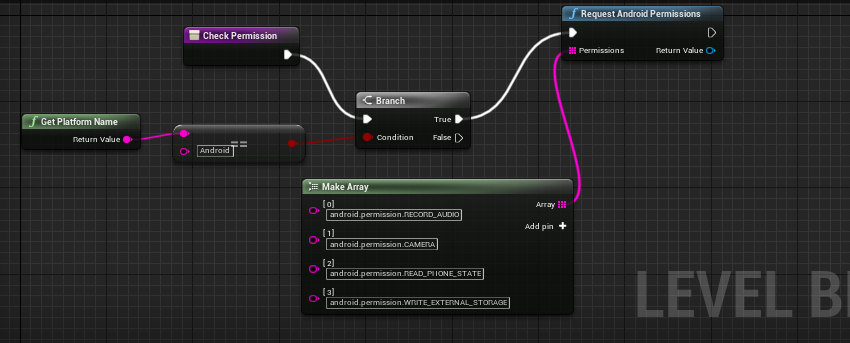


# FAQs

### What should I do if UE4 Editor crashes on MacOS?
Make sure you have added the following audio/video permissions to `info.plist` of **UE4Editor.app**.
```
<key>NSCameraUsageDescription</key>
<string>Video calls are possible only with camera permission.</string>
<key>NSMicrophoneUsageDescription</key>
<string>Audio calls are possible only with mic access.</string>
```
### The project is failing to open on MacOS, and from the Editor log, the follow error occured:
```
/Users/Shared/Epic Games/UE_4.27/Engine/Source/Runtime/Engine/Classes/Materials/Material.h:1279:26: error: variable 'LayerNames' set but not used [-Werror,-Wunused-but-set-variable]

const TArray<FText>* LayerNames = &LayersExpression->GetLayerNames();
^

1 error generated.
```
Edit Agora-Unreal-RTC-SDK-NG/Agora-Unreal-SDK-CPP-Example/Source/*.cs

Add lines to each script:
```
bOverrideBuildEnvironment = true;
AdditionalCompilerArguments = "-Wno-unused-but-set-variable";
```

### When opening the project on macOS, you may encounter blocking errors related to frameworks or receive notifications that the app is damaged.How to quickly get over this?

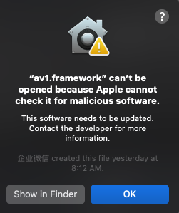

Even on older versions of macOS, you may encounter the following error message: **"AppXXX is damaged and can’t be opened. You should move it to the Trash."**

This error occurs because Mac's Gatekeeper blocks unsigned frameworks.

To resolve issues related to trusted execution, you can run the script **MacRATrust.sh** located in the project folder.

Alternatively, you can manually unlock the application by allowing the target framework in the **Privacy & Security** tab of your Mac's **System Preferences**.


### What should I do for the error "failed to load because module 'AgoraPlugin' could not be loaded" ?

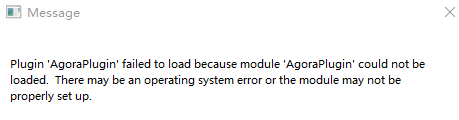

Try deleting the [Binaries] folder in your project

### Why can't I see the shared screen in the ScreenShare case on MacOS ?

Make sure you have accepted or added "Screen Recording" permission for the App (and the UE Editor) in your Mac Security and Privacy setting.

### Why our app dpi changed after joinchannel?

You can tick the checkboxes below
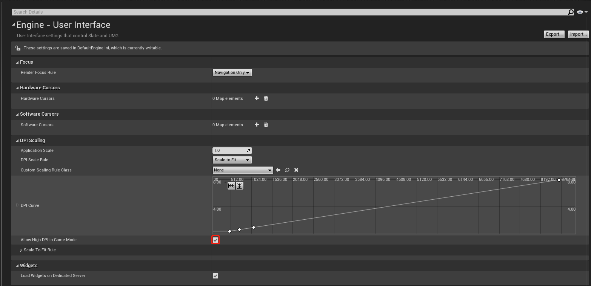

# Connect With Us
- If you have any questions, create an issue [here](https://github.com/AgoraIO-Extensions/Agora-Unreal-SDK-CPP-NG/issues).
- You can find full API document at [Document Center](https://docs.agora.io/en/)
