## P**rerequisite**

- Due to system limitations, screen sharing only supports iOS 12.0 or later.
- This feature requires high device performance, and Agora recommends that you use it on iPhone X (Nov, 2017) and later models.

### Technical Principle

Screen sharing on the iOS side is achieved by recording the screen using the iOS native ReplayKit framework in the Extension, and then adding the screen sharing stream as a user to the channel. Since Apple does not support capturing the screen in the main app process, you need to create a separate Extension for the screen sharing flow.

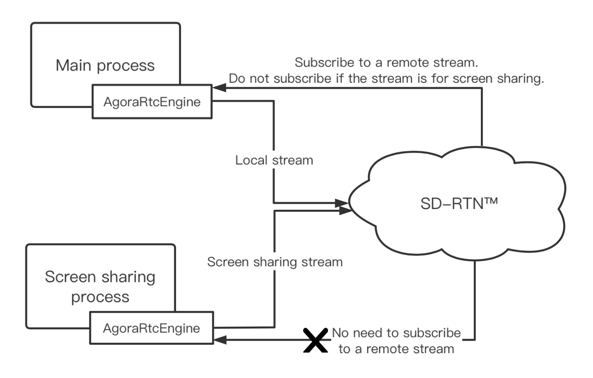

## How to Enable IOS ScreenShare

A**lso, solve: How to Add an IOS Extension To Your UE Project**

1. Package Your UE Project for IOS
2. Get the IOS packaging log, find the command to generate the IOS xcode project (xcworkspace)
3. cd into your UE engine batch file folder

```jsx
cd "/Users/Shared/Epic Games/UE_4.27/Engine/Build/BatchFiles/Mac"
```

4. Run the command to generate a IOS xcode project

```jsx
./RunMono.sh "/Users/Shared/Epic Games/UE_4.27/Engine/Binaries/DotNET/UnrealBuildTool.exe" -XcodeProjectFiles -project="/Users/admin/Documents/MacProject2/AgoraExample.uproject" -platforms=IOS -game -nointellisense -IOSdeployonly -ignorejunk -projectfileformat=XCode -includetemptargets -automated -log="/Users/admin/Library/Logs/Unreal Engine/LocalBuildLogs/UBT-.txt"
```

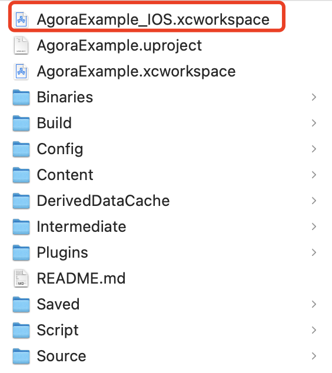

5. Open your Project_IOS xcode project and add a **Broadcast Upload Extension** to your UE Project
    
    In Xcode, click **File > New > Target...**, select **Broadcast Upload Extension** in the pop-up window, and click **Next**.
    

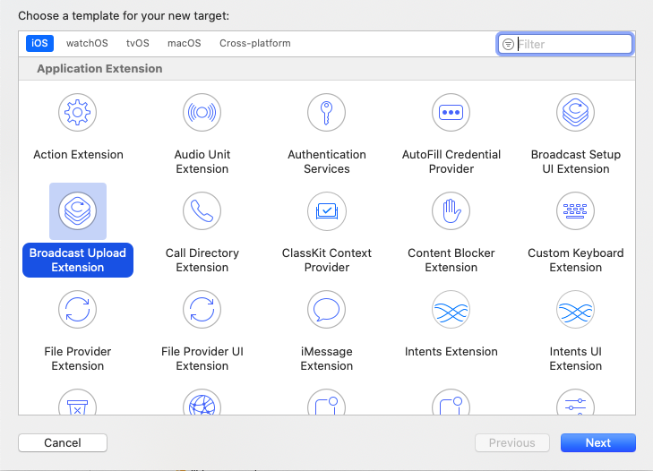

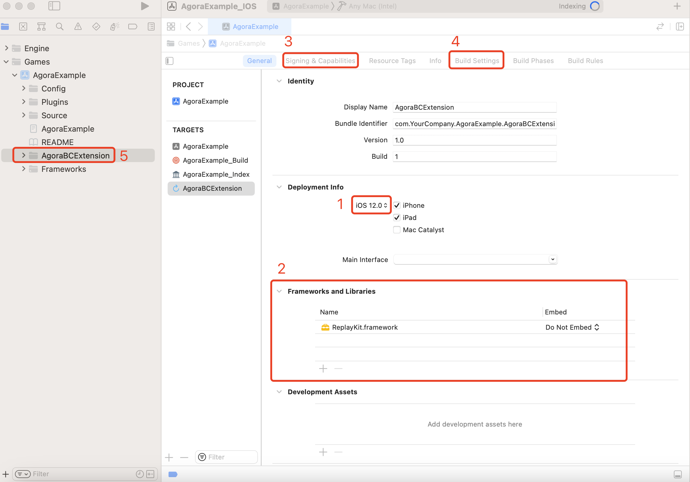

(1) Set the iOS version to 12.0 or later under **Deployment Info**. Make sure the app and extension have the same TARGETS/Deployment/iOS version.

(2) Unzip the IOS frameworks in our Agora Plugin (e.g., In **MyIOSFrameworks** folder), add frameworks to the extension

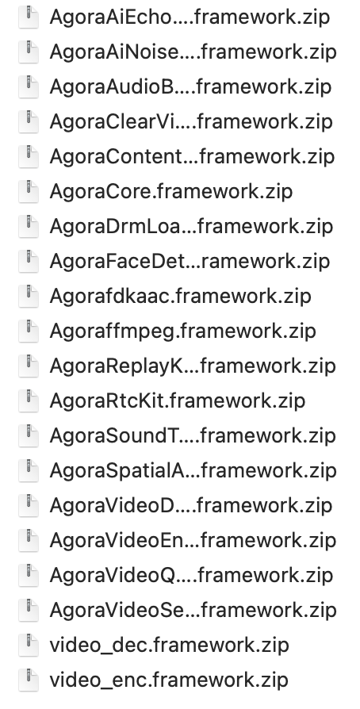

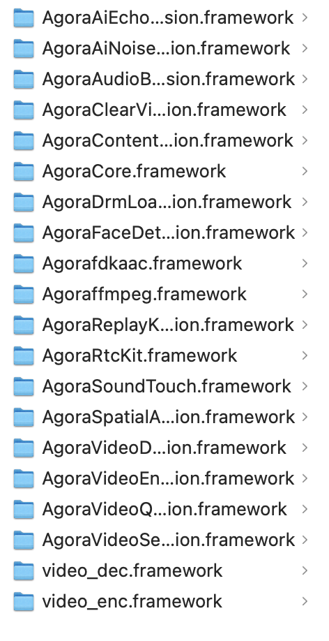

(3) Config the proper signing

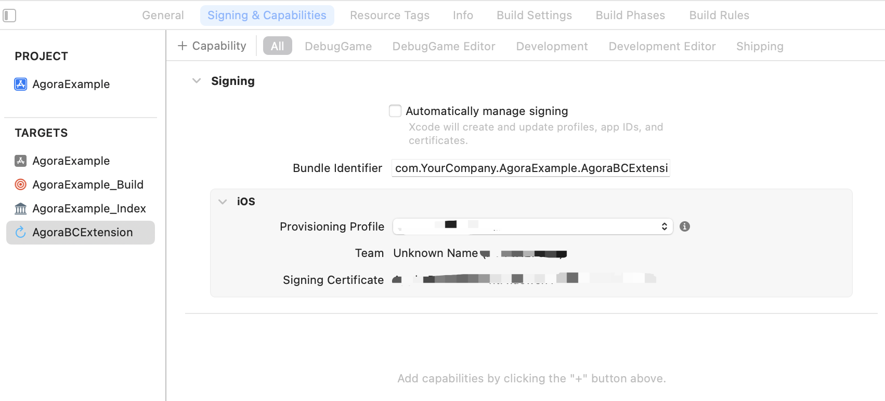

(4) Set the framework search path to your IOS frameworks folder here (e.g., **MyIOSFrameworks** folder above).

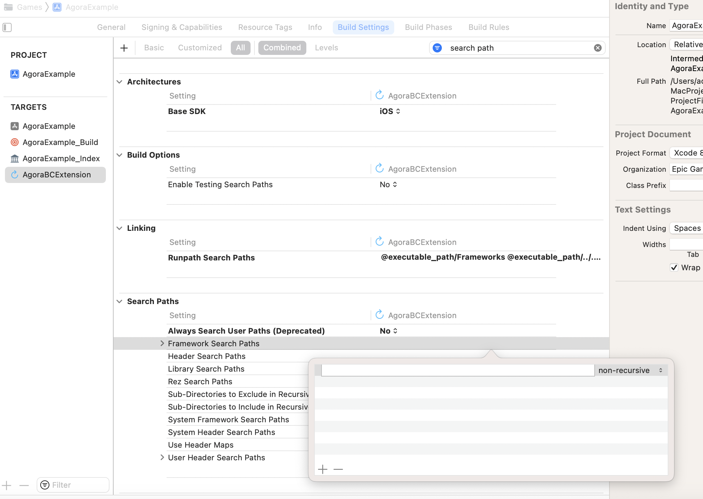


(5) Modify code to use **AgoraReplayKitHandler**

```jsx
#import <ReplayKit/ReplayKit.h>
#import <AgoraReplayKitExtension/AgoraReplayKitHandler.h>
@interface SampleHandler : AgoraReplayKitHandler

@end
```

Delete all the original implementations or add your own implementations.

```jsx
#import "SampleHandler.h"

@implemetation SampleHandler

@end
```

6. Build Your App

You can find the command in your ios packaging log.

```jsx
/usr/bin/env UBT_NO_POST_DEPLOY=true /usr/bin/xcrun xcodebuild build -workspace "/Users/admin/Documents/MacProject2/AgoraExample_IOS.xcworkspace" -scheme 'AgoraExample' -configuration "DebugGame" -destination generic/platform=iOS -sdk iphoneos CODE_SIGN_IDENTITY="Apple Development: XXXX" PROVISIONING_PROFILE_SPECIFIER=XXXXX-XXXXX
```

 

7. Get Your Application

You can find your app in the **Binaries/IOS** folder

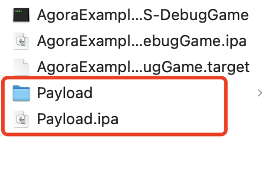

Compress the **Payload** folder and rename it to **YourProject.ipa**. In the above pic, **Payload.ipa** is the final product your want.

## How to use

1. Enter a ScreenShare related example scene, then click **StartScreenShare.** A successful channel join would return 0. Here, you may see a white box, since ScreenRecording has not been started.

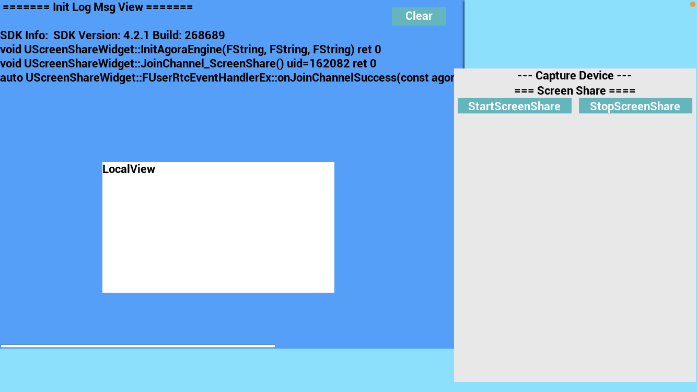

2. Access the iOS quick control panel and long press the Screen Recording button

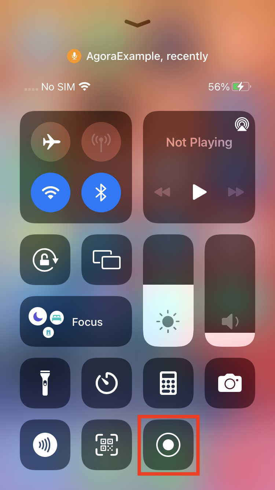

3. Select the App, in this example, we named it as **AgoraBCExtension**. And press **Start Broadcast**

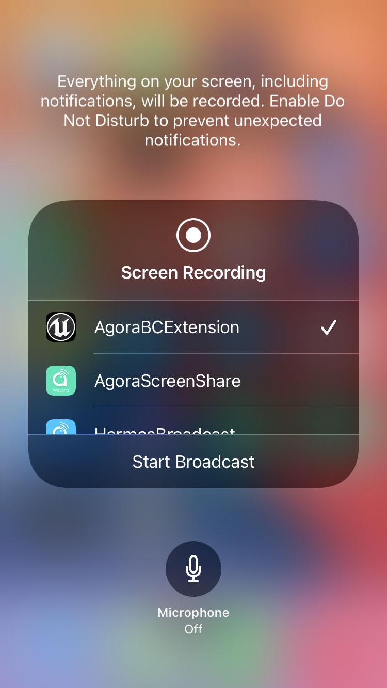

4. The **Screen Recording** title should be shown:

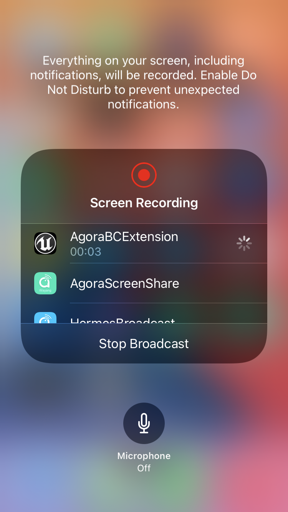

5. Switch back into the App, you should see the local view now is showing the screen.

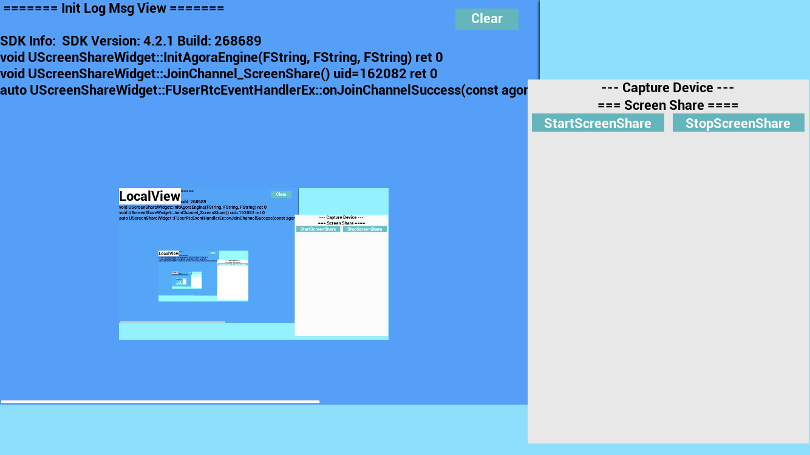

### Development Considerations

- Make sure the app and extension have the same TARGETS/Deployment/iOS version.
- The Broadcast Upload Extension's memory usage is limited to 50 MB, please make sure that the extension's memory usage for screen sharing does not exceed 50 MB.
- In the process of screen sharing, you need to call the `muteAllRemoteVideoStreams` and `muteAllRemoteAudioStreams` methods to cancel receiving streams from remote users to avoid repeated subscriptions.