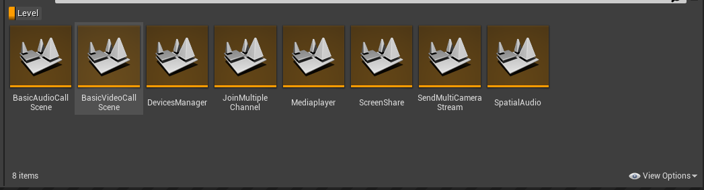
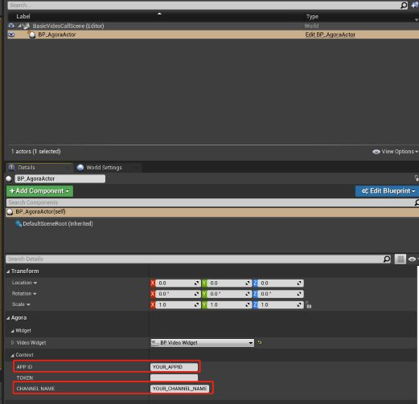

# API-CPP-Example
This is a demo program to show how to call API of Agora Unreal SDK.
## Example Case

### Basic Case
- JoinChannelAudio
- JoinChannelVideo
### Advance Case
- DvicesManager
- JoinMultipleChannel
- MediaPlayer
- ScreenShare
- SendMultiCameraStream
- SpatialAudio

#### case levels



Each level can run independently.
You can switch the level to be run in Edit/Project Settings/Default maps of Unreal Editor.


## Environment Requirements
- Unreal Engine 4.27.2 or above (Contain Unreal5)
- **Developing for Android:**
  - Android Studio 3.5.3 or above
  - Visual Studio 2017 15.6 or above
  - A real device for testing
- **Developing for iOS and macOS:**
  - Xcode 11.0 or above
  - OS X 10.11 or above
  - A valid developer signature for your project
- **Developing for Windows:**
    - OS: Windows 7 SP1 or above (64-bit based on x86-64)
    - Disk space: at least 1.64 GB of space after the IDE and relevant tools are installed
    - [Visual Studio 2019](https://visualstudio.microsoft.com/zh-hans/downloads/)


## Supported Platforms

- Android(arm64-v8a,arneabi-v7a)
- iOS
- MAC
- Windows 32-bit (Unreal5 does not support it, so it is disabled by default in AgoraPluginLibrary.Build.cs, if you want to use, please uncomment it)
- Windows 64-bit


## Run Project 

### Create an Account and Obtain an App ID 

To build and run the sample application, first obtain an app ID:

1) Create a developer account at [agora.io](https://console.agora.io/projects?isTrusted=true). Once you finish the sign-up process, you are redirected to the dashboard.
2) Navigate in the dashboard tree on the left to "Project Management".
3) Copy the app ID that you obtain from the dashboard into a text.

### Integrating the SDK

1. Download the SDK and its [source code](https://www.baidu.com). If you have any questions, create an issue [here](https://github.com/AgoraIO-Extensions/Agora-Unreal-SDK-CPP-NG/issues).
2. unZip SourceCode, Create [Plugins] floder in your project root directory.Copy unZip file to [Plugins];
3. run your project

### Compile and run demo. 

1) Open any level, for example Basic/joinChannelAudio/BasicAudioCall/ You can find a blueprint named BP_Agoractor in the WorldOutliner, enter your appid and channelname in the position below.
  


2) Package project:

#### Windows Packaging

File->Package Project->Windows->Windows(64-bit)


#### Mac Packaging

File -> Package Project -> Mac

##### In info.plist Add device permissions to file:

1. Right click the compiled xxx.app File - select "Show Package Contents"


2. Enter "contents ->" Info.plist "

3. Select "Information Property List" and add the following two permissions:

Privacy - Camera Usage Description
Privacy - Microphone Usage Description


##### Add the SDK framework to your compiled app

copy **xxx.framework** from **Plugs/AgoraPlugin/Source/ ThirdParty/Agora/MAC/Release** to ***MacNoEditor/xxx/Contents/MacOS/***.


##### IOS permissions
The following permissions are also required on IOS:

Privacy - Camera Usage Description
Privacy - Microphone Usage Description


To add the above permissions to the info.plist, you can

`<key>NSCameraUsageDescription</key><string>AgoraVideoCall</string> <key>NSMicrophoneUsageDescription</key><string>AgoraVideoCall</string>`
**Edit-> Project Settings->Platforms: iOS**

Add to additional plist data.


Finally, you can package the project.

#### Android package

File -> Package Project -> Android

In Android, the following permissions need to be applied dynamically, which can be done through the blueprint class.

1. android.permission.RECORD_AUDIO
2. android.permission.CAMERA
3. android.permission.READ_PHONE_STATE
4. android.permission.WRITE_EXTERNAL_STORAGE

you can include "AndroidPermission/Classes/AndroidPermissionFunctionLibrary.h" and call this method to get permission.


##FQAs

### What should I do if UE4 Editor crashes on macOS?
Make sure you have added the following audio/video permissions to `info.plist` of **UE4Editor.app**.
```
<key>NSCameraUsageDescription</key>
<string>Video calls are possible only with camera permission.</string>
<key>NSMicrophoneUsageDescription</key>
<string>Audio calls are possible only with mic access.</string>
```
### What should I do "failed to load because moudle 'AgoraPlugin' could not be loaded" ?


you shoud delete [Binaries] floder in your project

### What should I do can not find screen in macOS ?
 
Make sure you have add "Screen recording" in your Mac Security and Privacy
