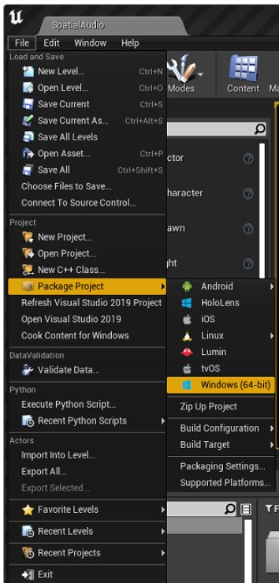

# Agora Unreal C++ SDK API-Example
## Overview

This project contains different scenes on how to integrate the Agora SDK APIs into your project.  You may run the project from the high level or go into a particular level to experience a single API example.

## Prerequisites
 1. Agora Developer Account
 2. Unreal Engine 4.27 or above (including UE5)
 3. Platform support

| Platform | IDE  | OS | Architecture|Note|
|--|--|--|--|--|
|  Android|  Android Studio 3.5.3 or above| [see Unreal Android requirement](https://docs.unrealengine.com/4.27/en-US/SharingAndReleasing/Mobile/Android/AndroidSDKRequirements/)|arm64-v8a, arneabi-v7a|Real devices only (not working on emulators); NDK version 21
|iOS|XCode 11.0 or above|[see Unreal IOS requirement](https://docs.unrealengine.com/4.27/en-US/SharingAndReleasing/Mobile/iOS/DeviceCompatibility/)|--|Valid Apple developer signature required
|MacOS|XCode 11.0 or above|OS X 10.11 or above|Intel, M1|same as above
|Windows 64bit|Visual Studio 2019|Windows 7 SP1 or above|Intel|Disk space: at least 1.64 GB of space after the IDE and relevant tools are installed
|Windows 32bit|Visual Studio 2019|Windows 7 SP1 or above|Intel|Unreal5 does not support it, so it is disabled by default in AgoraPluginLibrary.Build.cs, if you want to use, please uncomment it|


## Example Case

### Basic Case
- JoinChannelAudio
- JoinChannelVideo
### Advance Case
- DeviceManager
- JoinMultipleChannel
- MediaPlayer
- ScreenShare
- SendMultiCameraStream
- SpatialAudio


## Run Project

### Obtain an App ID

Before you can build and run any Agora project, you will need to add your AppID to the configuration. Go to your  [developer account’s project console](https://console.agora.io/projects), create a new AppId or copy the AppId from an existing project.

**Note**  it is important that for a production ready project, you should always use an AppId with token enabled. However, in testing a demo, you will skip this part. Using a testing mode AppId can save time for POC integration.  [](https://user-images.githubusercontent.com/1261195/110023464-11eb0480-7ce2-11eb-99d6-031af60715ab.png)

### Integrating the SDK

1. Download the SDK and its from [the Release area](https://github.com/AgoraIO-Extensions/Agora-Unreal-RTC-SDK-NG/releases).
2. Create a folder named *Plugins* in your project's root directory.  
3. Unzip the SDK files to *Plugins*
 


### Compile and Run the Demo
You may run the demos at a high level loader or at any level of the individual API samples.
**1)  Running at a high level**
Compile the project and then hit the Play button on the UE Editor.  You should get a main  screen like the following:


Fill in your App ID, Channel Name and optionally the token if you set up the application with certificate enabled.  You can now press a button to navigate to any of the API sample level.

**2) Running at individual level**
In case you are focusing on one API sample, you may run the individual code the following way, using *Basic/joinChannelAudio/BasicAudioCall/* as an example:
	- Find a blueprint named **BP_Agoractor** in the **WorldOutliner**, enter your AppID and Channel Name in the position below.


## Making a Build (Project Packaging):


### Windows Packaging

File->Package Project->Windows->Windows(64-bit)



### MacOS Packaging

File -> Package Project -> Mac

#### Add device permissions to plist.info:

1. Right click the compiled xxx.app File - select "Show Package Contents"


2. Edit "Contents ->" Info.plist" (Double-click to open it in XCode)

3. Select "Information Property List" and add the following two permissions:

- Privacy - Camera Usage Description
- Privacy - Microphone Usage Description


#### Add the SDK frameworks

Copy ***.framework** from ***Plugs/AgoraPlugin/Source/ ThirdParty/Agora/MAC/Release*** to ***MacNoEditor/xxx/Contents/MacOS/*** .


### IOS Packaging
The following permissions are also required on iOS:

- Privacy - Camera Usage Description
- Privacy - Microphone Usage Description


To add the above permissions to the info.plist, you can enter them in the UE Editor.
1. **Copy the following text:**

`<key>NSCameraUsageDescription</key><string>AgoraVideoCall</string> <key>NSMicrophoneUsageDescription</key><string>AgoraVideoCall</string>`

2. Open the screen at **Edit-> Project Settings->Platforms: iOS**
3. Enter the text to the "**additional plist data**" field:


Finally, you can package the iOS project (*File->Package Project->iOS*).

### Android Packaging
Build Android via "File -> Package Project -> Android".  Note **ASTC** is a more common target for modern Android devices.

On Android, the following permissions need to be applied.
1. android.permission.RECORD_AUDIO
2. android.permission.CAMERA
3. android.permission.READ_PHONE_STATE
4. android.permission.WRITE_EXTERNAL_STORAGE

The API-Examples provides sample code in doing so.  

For instance, in AgoraVideoWidget.cpp, the following function is called to enable the permissions.
```cpp
void UAgoraVideoWidget::CheckAndroidPermission()
{
#if PLATFORM_ANDROID
	FString pathfromName = UGameplayStatics::GetPlatformName();
	if (pathfromName == "Android")
	{
		TArray<FString> AndroidPermission;
		AndroidPermission.Add(FString("android.permission.CAMERA"));
		AndroidPermission.Add(FString("android.permission.RECORD_AUDIO"));
		AndroidPermission.Add(FString("android.permission.READ_PHONE_STATE"));
		AndroidPermission.Add(FString("android.permission.WRITE_EXTERNAL_STORAGE"));
		UAndroidPermissionFunctionLibrary::AcquirePermissions(AndroidPermission);
	}
#endif
}
```


## FAQs

### What should I do if UE4 Editor crashes on MacOS?
Make sure you have added the following audio/video permissions to `info.plist` of **UE4Editor.app**.
```
<key>NSCameraUsageDescription</key>
<string>Video calls are possible only with camera permission.</string>
<key>NSMicrophoneUsageDescription</key>
<string>Audio calls are possible only with mic access.</string>
```

### When opening the project on MacOS, there are blocking errors on framework.  How to quickly get over this?


Mac's Gatekeeper blocks unsigned frameworks and you have to unblock them one by one.  If your environment is safe, you can temporarily allow Apps to run from Anywhere.  See this checkbox in System Preferences:


### What should I do for the error "failed to load because module 'AgoraPlugin' could not be loaded" ?


Try deleting the [Binaries] folder in your project

### Why can't I see the shared screen in the ScreenShare case on MacOS ?

Make sure you have accepted or added "Screen Recording" permission for the App (and the UE Editor) in your Mac Security and Privacy setting.

### Why the value of X Scale is -1 for the UImage in WidgetBlueprint?

This is a trick to do quick mirroring effect.

## Connect With Us
- If you have any questions, create an issue [here](https://github.com/AgoraIO-Extensions/Agora-Unreal-SDK-CPP-NG/issues).
- You can find full API document at [Document Center](https://docs.agora.io/en/)
